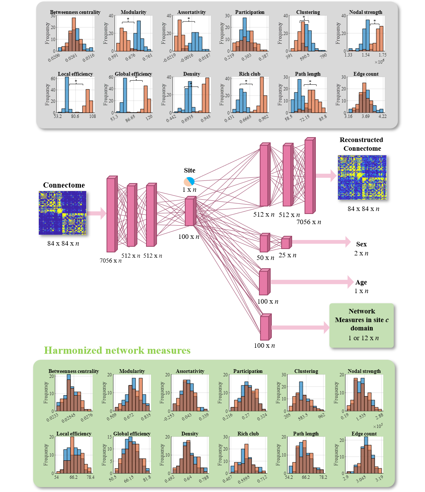

# LearningSiteInvariantConnectomeFeatures
This is the code base for my project on learning site-minimal bio-maximal representations of structural connectomes. It accompanies a paper entitled, "Learning disentangled structural connectome representations to harmonize brain network measures".

We include two ways of training: "Colearning" and "Individually learned". We compare each method and conclude that co-learning is more effective. 

